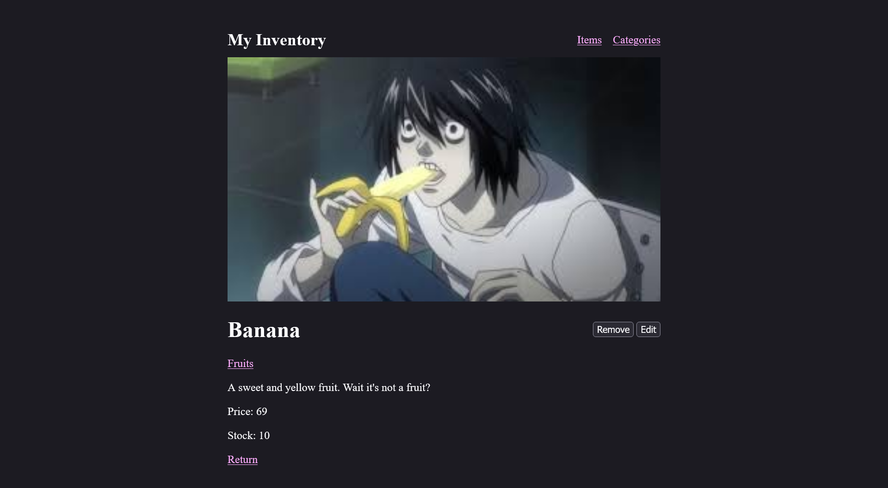

# My inventory

## Credit

This is a project assigned by TheOdinProject. For more information, please refer to [their curriculum](https://www.theodinproject.com/lessons/node-path-nodejs-inventory-application).

## Introduction

A simple web application that has every basic CRUD operations (create, reade, update, delete), in the format of managing items by category. This should be a basic foundation for my every future back-side related project.

## Attention

Before using/testing this application, you may please be more mindful of the content you will create and upload. Don't just put some random gibberish like 'hello world', 'testing' or something like that. Yes, I do not intend to put a password on every action on this application. I hope this would be a playground and also the reference to all other learners.

## Rants

By the time this project was ready to be published, there was a huge change in the Node course by TheOdinProject. It would be a waste of time just to rebuid the project all over again to meet their minor changes in the criterias. Forgive me if the project did not do what you readers would expect from this submission. Also, I noticed there was a huge wipe out of all the learners' previous submissions. I felt sorry for them.
